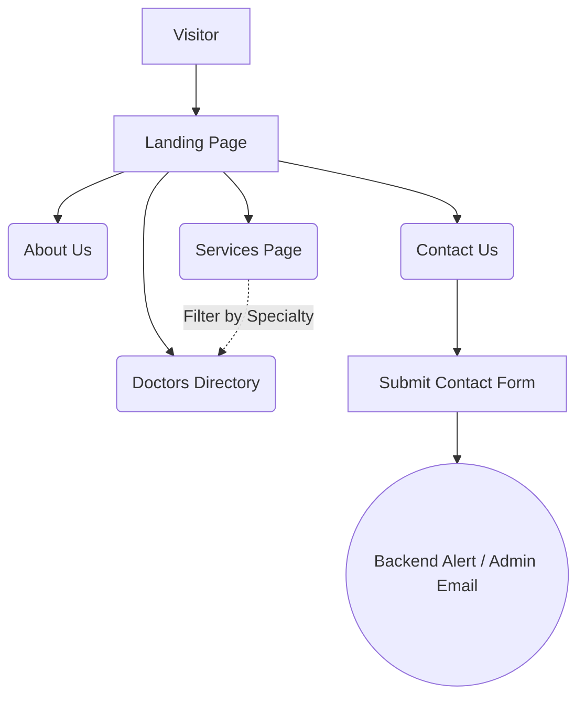
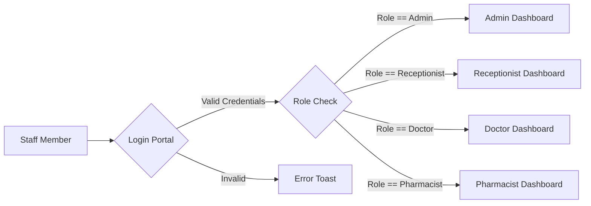
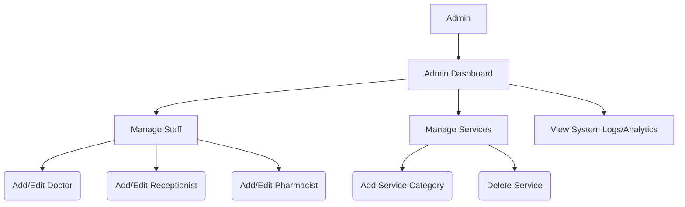
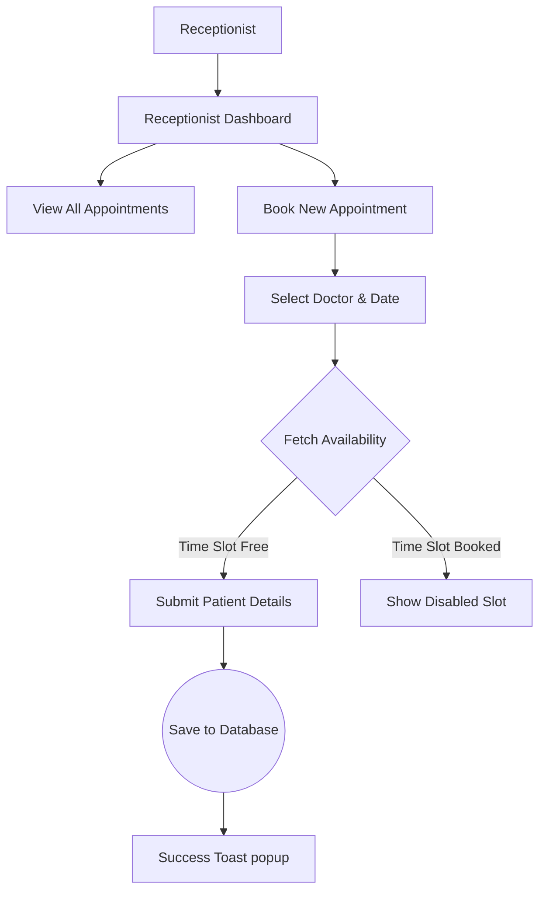
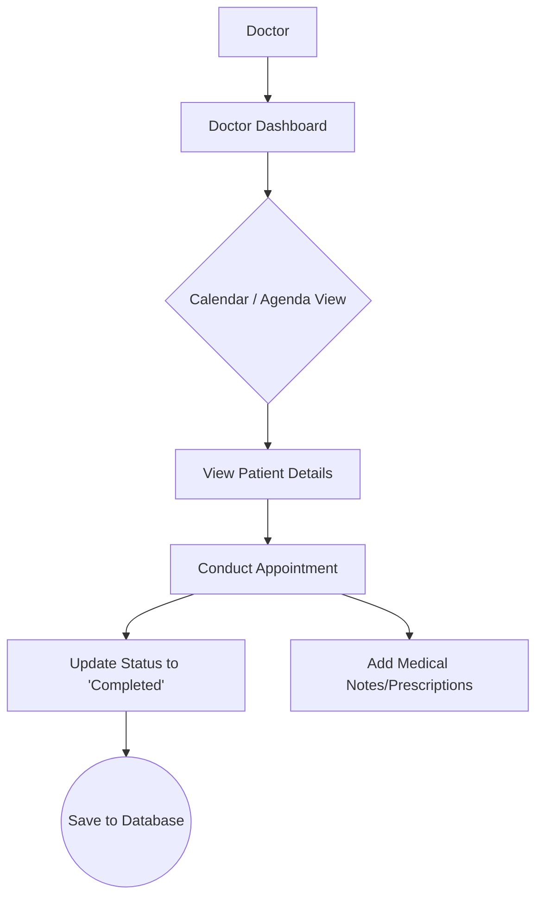
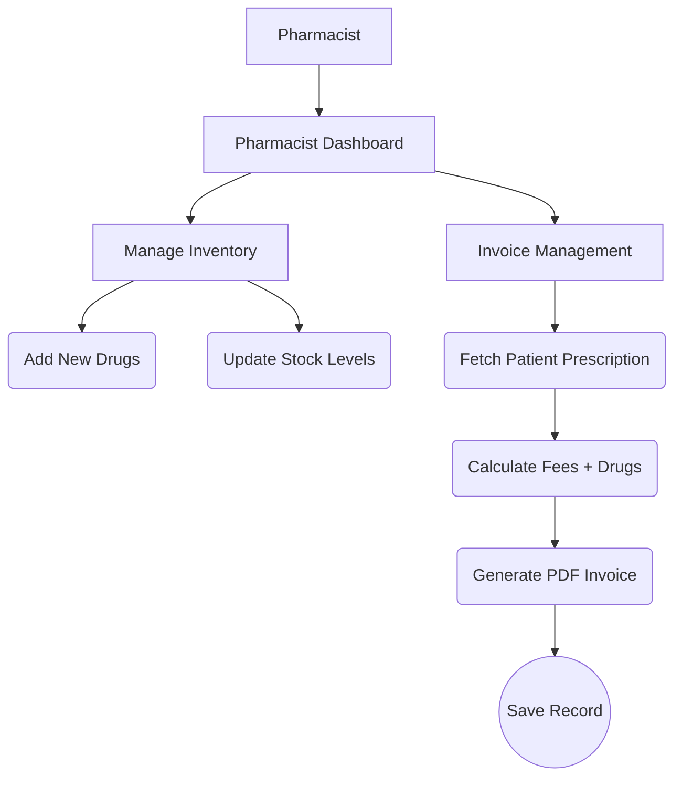

# CityGeneral Project Flow

The CityGeneral web application supports multiple user roles, each with a distinct set of responsibilities and accessible interfaces. Below are the specific workflows separated by the public user experience and the different internal staff roles.

---

## 1. Public Visitor Flow

Public users are patients or general visitors seeking information about the hospital, looking for specific services, or trying to find a doctor.

### Description

1. **Landing Page:** Visitors arrive at the main UI, providing a high-level overview of the hospital, quick links, and introductory information.
2. **Explore Sections:** Visitors can freely navigate to internal static and dynamic pages.
3. **Services:** View department descriptions and specific medical services provided. Clicking on a service filters and redirects to the Doctors page to display specialists for that service.
4. **Doctors:** Users view the directory of available doctors. Users can filter by specialty.
5. **Contact/About:** Users can view location details, send messages, or read about the hospital's history.

### Flowchart

---

## 2. Authentication & Authorization Flow

The application uses an authentication gateway to protect staff dashboards.

### Description

1. **Login Gateway:** Staff attempt to access their respective routes or login through the central `/login` or `/admin/login` portals.
2. **Verification:** Backend verifies credentials (Mongoose/Bcrypt validation).
3. **Role-based Redirection:** Upon successful login and token generation, the PrivateRoute component dynamically directs the user to their specific dashboard based on their role (`Admin`, `Doctor`, `Receptionist`, `Pharmacist`).

### Flowchart

---

## 3. Administrative Flow (Admin Dashboard)

Admins are responsible for maintaining the master data of the hospital, including staff accounts and medical services.

### Description

- **Staff Management:** Add new Doctors, Receptionists, and Pharmacists to the system. Edit existing staff details.
- **Service Management:** Add or delete medical service categories.
- **Analytics:** View high-level metrics (e.g., total appointments, total revenue, staff counts).

### Flowchart

---

## 4. Receptionist Operations Flow

Receptionists handle the day-to-day front desk operations, primarily focusing on patient appointment scheduling.

### Description

- **Appointment Booking:** Select a doctor and date to view real-time availability. Confirm and book open slots for patients.
- **Schedule Management:** View all booked, pending, or completed appointments.
- **Patient Coordination:** Send updates or manage daily patient check-ins.

### Flowchart

---

## 5. Doctor Operations Flow

Doctors log in to view their specific daily schedules and manage their patients' clinical data.

### Description

- **Daily Appointments:** View interactive calendar schedules for the day/week.
- **Consultation:** Mark appointments as complete.
- **Prescriptions/Diagnoses:** Link medical notes, recommended drugs, or invoice triggers to patient files after consultation.

### Flowchart

---

## 6. Pharmacist Operations Flow

Pharmacists manage the drug inventory and process patient invoices based on doctor prescriptions and services rendered.

### Description

- **Inventory Management:** Add, update, and manage available drugs/medications.
- **Billing & Invoices:** Generate bills for patients involving consultation fees and medication costs. Print/export invoices (often to PDF using `jsPDF`).

### Flowchart

